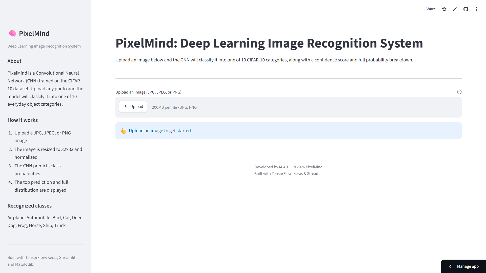
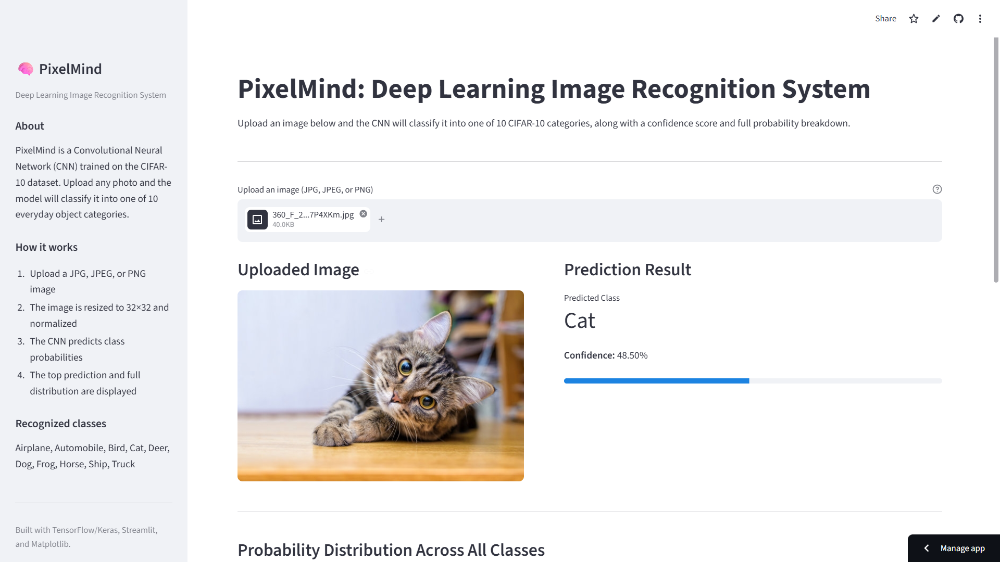

<div align="center">

# 🧠 PixelMind: Deep Learning Image Recognition System

**A production-ready Streamlit web app that classifies images into 10 CIFAR-10 categories using a trained TensorFlow/Keras CNN.**


</div>

---

## 📖 Project Overview

**PixelMind** is an end-to-end deep learning application built around a custom Convolutional Neural Network (CNN) trained on the **CIFAR-10** dataset. Users upload any JPG, JPEG, or PNG image through a clean Streamlit interface, and the app:

1. Preprocesses the image (RGB conversion, 32×32 resize, normalization)
2. Runs it through the trained CNN
3. Returns the predicted class, a confidence score, and the full probability distribution across all 10 categories — visualized as a bar chart

**🔗 Live Website:** [https://pixelmind-cifar10-classifier.streamlit.app/](https://pixelmind-cifar10-classifier.streamlit.app/)

<p align="center">
  
  <br>
  <em>Sample images from the CIFAR-10 dataset — 10 classes of 32×32 color images.<br>
  Image source: <a href="https://medium.com/fenwicks/tutorial-2-94-accuracy-on-cifar10-in-2-minutes-7b5aaecd9cdd">"Tutorial 2: 94% accuracy on Cifar10 in 2 minutes" – David Yang, Medium</a> (©CIFAR)</em>
</p>

---

## ✨ Features

- 📤 **Drag-and-drop image upload** — supports JPG, JPEG, and PNG formats
- ⚡ **Real-time inference** — predictions return in well under a second on CPU
- 📊 **Full probability breakdown** — not just the top guess, but the model's confidence across all 10 classes
- 📈 **Visual bar chart** of class probabilities, built with Matplotlib
- 🧱 **Cached model loading** via `@st.cache_resource` for fast reruns
- 🛡️ **Robust error handling** for corrupted files, non-image uploads, and inference failures
- 🎨 **Clean, professional UI** with a descriptive sidebar and responsive column layout

---

## 🛠️ Technologies Used

| Technology | Purpose |
|---|---|
| **Python 3.11+** | Core programming language |
| **TensorFlow / Keras** | Loading and running the trained CNN model |
| **Streamlit** | Interactive web application framework |
| **NumPy** | Array manipulation and numerical preprocessing |
| **Pillow (PIL)** | Image decoding, conversion, and resizing |
| **Matplotlib** | Rendering the probability distribution bar chart |

---

## 📊 Dataset Information

The model was trained on the **CIFAR-10** dataset, a widely-used benchmark in computer vision:

- **60,000** total color images, each **32×32 pixels**, 3 RGB channels
- **10 classes**, with **6,000 images per class**
- Split into **50,000 training images** and **10,000 test images**
- Classes: `Airplane`, `Automobile`, `Bird`, `Cat`, `Deer`, `Dog`, `Frog`, `Horse`, `Ship`, `Truck`
- Originally collected by Krizhevsky, Hinton, and Nair at the University of Toronto

Because images are tiny (32×32) and visually similar across categories (e.g., cat vs. dog, automobile vs. truck), CIFAR-10 is a deceptively challenging dataset for image classification — simple models plateau around 70–80% accuracy, while well-tuned CNNs can exceed 90%.

---

## 🧠 Model Architecture

The trained model (`cifar_img_classifier.keras`) is a **Sequential CNN** with five convolutional blocks followed by a fully-connected classifier head:

```
Input (32, 32, 3)
 ├── Conv2D(64, 3x3) → BatchNorm → ReLU → MaxPool(2x2) → Dropout(0.25)
 ├── Conv2D(64, 3x3) → BatchNorm → ReLU → MaxPool(2x2)
 ├── Conv2D(128, 3x3) → BatchNorm → ReLU → Dropout(0.25)
 ├── Conv2D(128, 3x3) → BatchNorm → ReLU
 ├── Conv2D(256, 3x3) → BatchNorm → ReLU → MaxPool(2x2)
 ├── Flatten
 ├── Dense(256) → BatchNorm → ReLU → Dropout(0.5)
 ├── Dense(128) → BatchNorm → ReLU → Dropout(0.5)
 ├── Dense(128) → BatchNorm → ReLU → Dropout(0.5)
 └── Dense(10, activation="softmax")
```

- **Trainable parameters:** ~1.66 million
- **Regularization:** Batch Normalization after every weighted layer, plus Dropout (0.25–0.5) throughout to reduce overfitting
- **Output:** A 10-element probability vector (softmax), one value per CIFAR-10 class

### How does a CNN actually work?

A Convolutional Neural Network learns to recognize images by stacking layers that each extract progressively more abstract visual patterns:

- **Convolutional layers** slide small filters (kernels) across the image to detect local patterns like edges, corners, and textures. Early layers pick up simple features; deeper layers combine them into complex shapes (e.g., "wheel," "wing," "fur").
- **Activation functions** (ReLU here) introduce non-linearity, letting the network model complex relationships rather than just straight lines.
- **Pooling layers** (MaxPooling) downsample the feature maps, keeping the strongest signals while reducing spatial size and computation.
- **Batch Normalization** stabilizes and speeds up training by normalizing activations between layers.
- **Fully-connected (Dense) layers** at the end take the extracted features and map them to the final class scores.
- **Softmax** converts those raw scores into a probability distribution that sums to 100% across all classes.

<p align="center">
  
  <br>
  <em>How a CNN processes an image through convolution, pooling, and fully-connected layers.<br>
  Image source: <a href="https://www.analyticsvidhya.com/blog/2021/09/convolutional-neural-network-pytorch-implementation-on-cifar10-dataset/">Analytics Vidhya — "Convolutional Neural Network: PyTorch Implementation on CIFAR-10 Dataset"</a></em>
</p>

**Further reading on CNNs and CIFAR-10:**
- [Convolutional Neural Network – PyTorch Implementation on CIFAR-10 Dataset (Analytics Vidhya)](https://www.analyticsvidhya.com/blog/2021/09/convolutional-neural-network-pytorch-implementation-on-cifar10-dataset/)
- [Transfer Learning: CIFAR-10 Classification using VGG16 (LinkedIn Pulse, Davis Joseph)](https://www.linkedin.com/pulse/transfer-learning-cifar-10-classification-using-vgg16-davis-joseph-kdive)

---

## 💻 Installation Steps

```bash
# 1. Clone the repository
git clone https://github.com/<your-username>/pixelmind-cifar10-classifier.git
cd pixelmind-cifar10-classifier

# 2. (Recommended) Create and activate a virtual environment
python -m venv venv
source venv/bin/activate        # On Windows: venv\Scripts\activate

# 3. Install dependencies
pip install -r requirements.txt

# 4. Make sure cifar_img_classifier.keras is in the same folder as app.py
```

> ⚠️ The trained model file (`cifar_img_classifier.keras`, ~20 MB) must sit alongside `app.py` for the app to load correctly.

---

## 🚀 Usage Instructions

1. **Run the app locally:**
   ```bash
   streamlit run app.py
   ```
2. Your browser will open automatically at `http://localhost:8501`.
3. **Upload an image** — click the file uploader and choose a JPG, JPEG, or PNG file.
4. View the results:
   - The uploaded image, displayed on the left
   - The **predicted class** and **confidence percentage** on the right
   - A **bar chart** showing the probability for all 10 classes below
5. Expand **"View raw probability values"** to see exact percentages for every class.

---

## 📸 Results / Screenshots

## Application Preview

### Home Page


### Prediction Result


For reference, here's an example of how a small CNN performs on CIFAR-10 test images — correctly predicting most classes:

<p align="center">
  
  <br>
  <em>Example predictions vs. true labels on CIFAR-10 test images (illustrative example, not from this model).<br>
  Image source: <a href="https://corochann.com/cifar-10-cifar-100-inference-code-591/">corochannNote — "CIFAR-10, CIFAR-100 inference code"</a></em>
</p>

---

## 📚 References

- [Tutorial 2: 94% accuracy on Cifar10 in 2 minutes — David Yang, Medium](https://medium.com/fenwicks/tutorial-2-94-accuracy-on-cifar10-in-2-minutes-7b5aaecd9cdd)
- [CIFAR-10, CIFAR-100 inference code — corochannNote](https://corochann.com/cifar-10-cifar-100-inference-code-591/)
- [Convolutional Neural Network – PyTorch Implementation on CIFAR-10 Dataset — Analytics Vidhya](https://www.analyticsvidhya.com/blog/2021/09/convolutional-neural-network-pytorch-implementation-on-cifar10-dataset/)
- [Transfer Learning: CIFAR-10 Classification using VGG16 — LinkedIn Pulse](https://www.linkedin.com/pulse/transfer-learning-cifar-10-classification-using-vgg16-davis-joseph-kdive)

---

## 📄 License

This project is open-sourced under the [MIT License](LICENSE).

---

<div align="center">

Developed by **Your Name** · © 2026 PixelMind
<br>
Built with TensorFlow, Keras & Streamlit

</div>
